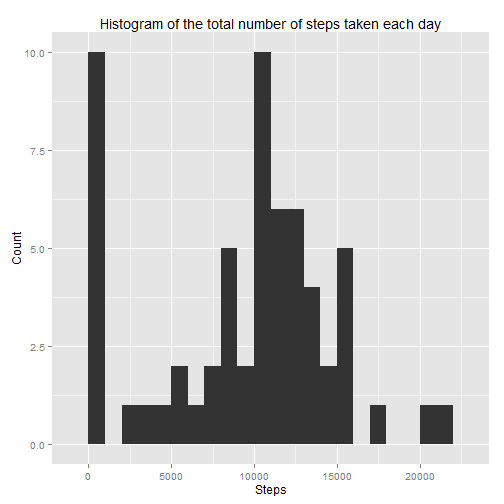
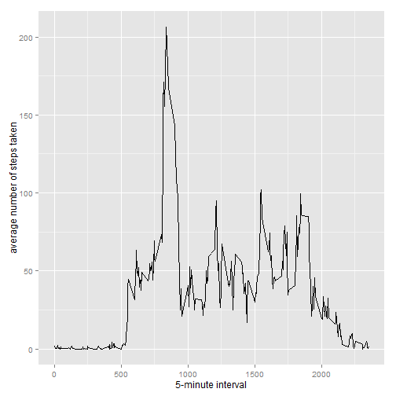
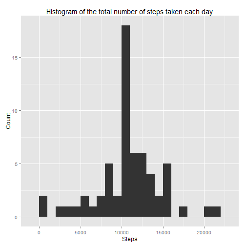
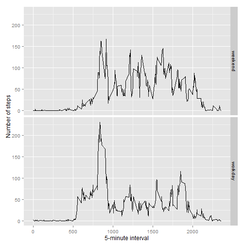

The document is written in a step-wised approach.

#Preparing Data
Loading data form zip file directly and packages used:

```r
library(ggplot2)
data<-read.csv(unz("activity.zip","activity.csv"))
```

#Assignment 1: What is mean total number of steps taken per day?

###1. Calculate the total number of steps taken per day.

```r
sumStepsPerDay<-aggregate(steps ~ date,data,sum,na.action=na.pass,na.rm=TRUE)
head(sumStepsPerDay,5)
```

```
##         date steps
## 1 2012-10-01     0
## 2 2012-10-02   126
## 3 2012-10-03 11352
## 4 2012-10-04 12116
## 5 2012-10-05 13294
```

###2.Make a histogram of the total number of steps taken each day.

```r
ggplot(data=sumStepsPerDay, 
       aes(sumStepsPerDay$steps)) + 
        geom_histogram(binwidth=1000)+
        labs(title="Histogram of the total number of steps taken each day")+
        labs(x="Steps",y="Count")
```

 

###3.Calculate and report the mean and median of the total number of steps taken per day.

```r
Stepsmean<-as.integer(mean(sumStepsPerDay$steps,na.rm=TRUE))
Stepsmedian<-as.integer(median(sumStepsPerDay$steps,na.rm=TRUE))
```

The mean of the total number of steps taken per day is 9354

The median of the total number of steps taken per day is 10395

#Assignment 2: What is the average daily activity pattern?
###1. Make a time series plot (i.e. type = "l") of the 5-minute interval (x-axis) and the average number of steps taken, averaged across all days (y-axis)


```r
average<-aggregate(steps~interval,data,mean,na.rm=TRUE,na.action=na.pass)
ggplot(data = average, 
       aes(x = average$interval, y = average$steps)) + 
        geom_line() + 
        xlab("5-minute interval") +
        ylab("average number of steps taken")
```

 

###2.Which 5-minute interval, on average across all the days in the dataset, contains the maximum number of steps?

```r
max<-average[which.max(average$steps),]
```

The interval contains the maximum number of steps is 835 
with steps 206

#Assignment 3: Imputing missing values
###1.Calculate and report the total number of missing values in the dataset (i.e. the total number of rows with NAs)


```r
totalmissingValue<-table(is.na(data$steps))
```
There are 2304 rows missed value. 

###2.Devise a strategy for filling in all of the missing values in the dataset. The strategy does not need to be sophisticated. For example, you could use the mean/median for that day, or the mean for that 5-minute interval, etc.
Comparison between two strategies:

```r
averagedate<-aggregate(steps~date,data,mean,na.rm=TRUE,na.action=na.pass)
```
Finding all the steps value in the date/interval that has missing value, simple summary can tell the story: 

```r
summary(averagedate[averagedate$date %in% data[is.na(data$steps),"date"],])
```

```
##          date       steps    
##  2012-10-01:1   Min.   : NA  
##  2012-10-08:1   1st Qu.: NA  
##  2012-11-01:1   Median : NA  
##  2012-11-04:1   Mean   :NaN  
##  2012-11-09:1   3rd Qu.: NA  
##  2012-11-10:1   Max.   : NA  
##  (Other)   :2   NA's   :8
```

```r
summary(average[average$interval %in% data[is.na(data$steps),"interval"],])
```

```
##     interval          steps        
##  Min.   :   0.0   Min.   :  0.000  
##  1st Qu.: 588.8   1st Qu.:  2.486  
##  Median :1177.5   Median : 34.113  
##  Mean   :1177.5   Mean   : 37.383  
##  3rd Qu.:1766.2   3rd Qu.: 52.835  
##  Max.   :2355.0   Max.   :206.170
```
Regards the dateset, if we choose the mean/median for that day, it simply fills number zero. Thus in this study we go for the mean for that 5-minute interval. Function defined as below:

```r
fillvalue<-function(steps,interval){
        filled<-NA
        if (is.na(steps))
                filled<-(average[average$interval==interval,"steps"])
        else filled<-c(steps)
        return(filled)
}
```


###3.Create a new dataset that is equal to the original dataset but with the missing data filled in.

```r
filleddata<-data
filleddata$steps<-mapply(fillvalue,filleddata$steps,filleddata$interval)
```

###4.Make a histogram of the total number of steps taken each day and Calculate and report the mean and median total number of steps taken per day. Do these values differ from the estimates from the first part of the assignment? What is the impact of imputing missing data on the estimates of the total daily number of steps?

```r
sumStepsPerDay_filled<-aggregate(steps ~ date,filleddata,sum,na.action=na.pass,na.rm=TRUE)
ggplot(data=sumStepsPerDay_filled, 
       aes(sumStepsPerDay_filled$steps)) + 
        geom_histogram(binwidth=1000)+
        labs(title="Histogram of the total number of steps taken each day")+
        labs(x="Steps",y="Count")
```

 

```r
Stepsfilledmean<-as.integer(mean(sumStepsPerDay_filled$steps,na.rm=TRUE))
Stepsfilledmedian<-as.integer(median(sumStepsPerDay_filled$steps,na.rm=TRUE))
```

The mean of the total number of steps taken per day is 10766

The median of the total number of steps taken per day is 10766

Thus the mean and median are higher than the assignment 1, as mostly the NA values (which by default are setted to 0) are filled with the mean for that 5-minute interval.

#Assignment 4:Are there differences in activity patterns between weekdays and weekends?

###1. Create a new factor variable in the dataset with two levels ‚<U+0080><U+0093> ‚<U+0080><U+009C>weekday‚<U+0080>ù and ‚<U+0080><U+009C>weekend‚<U+0080>ù indicating whether a given date is a weekday or weekend day.


```r
filleddata$weekday<-weekdays(as.Date(filleddata$date))
workday.or.weekend <- function(date) {
        if (date %in% c("Monday", "Tuesday", "Wednesday", "Thursday", "Friday")) 
        return("workday") 
        else if (date %in% c("Saturday", "Sunday")) 
        return("weekend") 
        else stop("invalid date")
}
filleddata$workdayorweekends<-sapply(filleddata$weekday,FUN=workday.or.weekend)
summary(filleddata)
```

```
##      steps                date          interval        weekday         
##  Min.   :  0.00   2012-10-01:  288   Min.   :   0.0   Length:17568      
##  1st Qu.:  0.00   2012-10-02:  288   1st Qu.: 588.8   Class :character  
##  Median :  0.00   2012-10-03:  288   Median :1177.5   Mode  :character  
##  Mean   : 37.38   2012-10-04:  288   Mean   :1177.5                     
##  3rd Qu.: 27.00   2012-10-05:  288   3rd Qu.:1766.2                     
##  Max.   :806.00   2012-10-06:  288   Max.   :2355.0                     
##                   (Other)   :15840                                      
##  workdayorweekends 
##  Length:17568      
##  Class :character  
##  Mode  :character  
##                    
##                    
##                    
## 
```

###2.Make a panel plot containing a time series plot (i.e. type = "l") of the 5-minute interval (x-axis) and the average number of steps taken, averaged across all weekday days or weekend days (y-axis). See the README file in the GitHub repository to see an example of what this plot should look like using simulated data.


```r
averagewithworkdays<-aggregate(steps~interval+workdayorweekends,data=filleddata,mean)
ggplot(averagewithworkdays, 
       aes(interval, steps)) + 
        geom_line() + 
        facet_grid(workdayorweekends ~ .) + 
        xlab("5-minute interval") +
        ylab("Number of steps")
```

 
